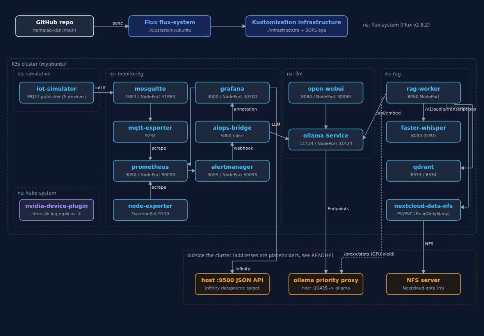
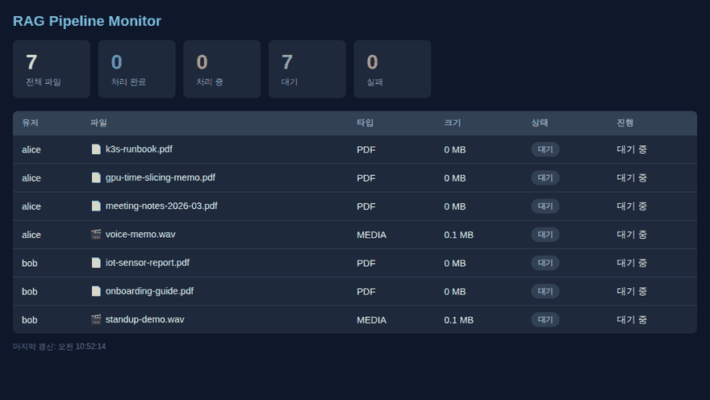
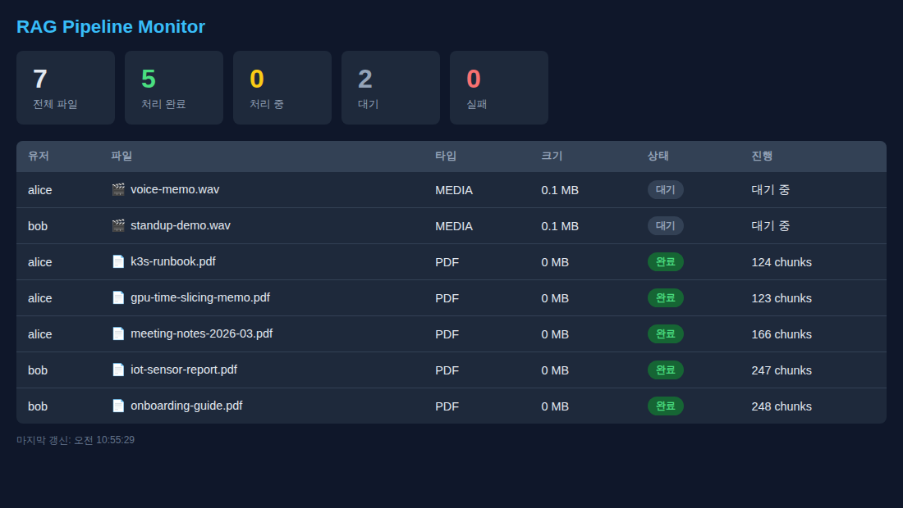
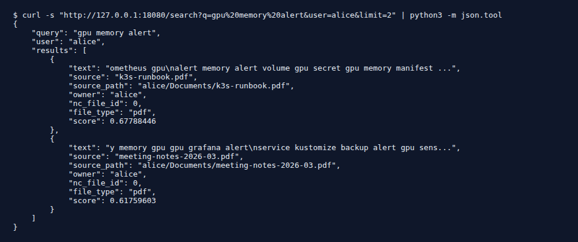

# homelab-k8s

단일 노드 K3s 홈랩 클러스터를 Flux로 운영하는 GitOps(Git 기반 운영) 저장소입니다. LLM(Large Language Model) 서빙, RAG(Retrieval-Augmented Generation) 파이프라인, IoT(Internet of Things) 모니터링을 Kustomize 매니페스트로 관리합니다.

**한국어** | [English](README.en.md)

## 구성도



`clusters/`와 `infrastructure/`의 매니페스트를 그대로 옮겨 그린 구성도입니다. 주황색 상자는 클러스터 밖에 있어야 하는 구성 요소입니다(이 저장소에는 매니페스트가 없습니다).

## 화면

이 저장소에서 직접 실행해 볼 수 있는 부분은 `images/rag-worker`입니다. 아래 화면은 클러스터 없이 로컬에서 rag-worker를 띄우고, 합성 PDF(Portable Document Format) 5개와 WAV(Waveform Audio File Format) 2개를 넣어 자동 스캔이 돌아가는 모습을 캡처한 것입니다(Qdrant 1.12.4 바이너리, Ollama `all-minilm` 임베딩 모델 사용, Whisper 서버는 띄우지 않음).



| 처리 완료 후 대시보드 | 검색 API(Application Programming Interface) 응답 |
|---|---|
|  |  |

WAV 파일은 Whisper 서버가 없어 처리에 실패했지만 대시보드에는 "대기"로 표시됩니다. 이 동작은 [docs/PROGRESS.md](docs/PROGRESS.md)에 기록해 두었습니다.

## 주요 기능

- **Flux GitOps**: `main` 브랜치를 1분 간격으로 가져와 `clusters/myubuntu` → `infrastructure/` 순서로 적용합니다. Flux v2.8.2 컴포넌트가 저장소에 포함되어 있습니다.
- **SOPS 암호화 시크릿**: `*.enc.yaml` 파일은 SOPS(Secrets OPerationS)와 age 키로 암호화하고, Flux가 배포 시점에 복호화합니다.
- **GPU(Graphics Processing Unit) 시분할**: NVIDIA device plugin 설정으로 GPU 1장을 4개 슬롯으로 나눠 씁니다.
- **LLM (`llm` 네임스페이스)**: 호스트에서 systemd로 도는 Ollama를 Service + Endpoints로 클러스터에 연결하고, Open WebUI를 함께 배포합니다.
- **RAG (`rag` 네임스페이스)**
  - `rag-worker`: Nextcloud 데이터(NFS 읽기 전용 마운트)를 10분마다 스캔해 PDF는 텍스트를 뽑고, 영상/음성은 faster-whisper로 받아쓴 뒤 Ollama로 임베딩해 Qdrant에 저장합니다.
  - 사용자별 검색 API(`/search`), 처리 현황 대시보드(`/dashboard`), 수동 업로드(`/process`)를 제공합니다.
  - 사용자가 LLM을 쓰고 있으면 GPU 작업 전에 대기합니다(우선순위 프록시의 `/proxy/stats` 확인).
- **모니터링 (`monitoring` 네임스페이스)**: Prometheus, Alertmanager, Grafana, node-exporter, Mosquitto(MQTT 브로커, Message Queuing Telemetry Transport), mqtt-exporter.
- **AIOps(AI for IT Operations) 브리지**: Alertmanager 웹훅을 받아 Ollama(`mistral:7b`)로 원인 분석을 만들고 Grafana 주석으로 남기도록 작성되어 있습니다.
- **IoT 시뮬레이터 (`simulation` 네임스페이스)**: 가상 장치 5대가 5초마다 온도·습도·기압·전력 값을 MQTT로 보내고, 5% 확률로 이상값을 섞습니다.
- **Grafana 대시보드**: LLMOps 모니터링(`llmops.json`), 인프라 토폴로지(`topology.json`). 두 대시보드 모두 호스트의 `:9500` JSON(JavaScript Object Notation) API를 Infinity 데이터소스로 읽습니다.
- **CI(Continuous Integration)**: GitHub Actions에서 yamllint, kubeconform, 대시보드 JSON 구조, SOPS 암호화 여부를 검사합니다.

## 사용 방법

### 1. 준비물

- NVIDIA GPU와 NVIDIA device plugin이 설치된 K3s 노드 1대
- `flux`, `kubectl`, `sops`, `age`, `docker` CLI(Command Line Interface)
- 호스트에서 도는 Ollama와 우선순위 프록시(포트 11435), Nextcloud 데이터를 내보내는 NFS(Network File System) 서버

### 2. 환경에 맞게 바꿀 값

저장소에는 실제 주소 대신 문서용 예시 주소(RFC(Request for Comments) 5737의 `192.0.2.x`)와 `example.com`이 들어 있습니다. 배포 전에 아래 값을 바꿔야 합니다.

| 파일 | 항목 | 현재 값 | 설명 |
|---|---|---|---|
| `infrastructure/llm/ollama.yaml` | `Endpoints.subsets[].addresses[].ip` | `192.0.2.10` | Ollama 우선순위 프록시가 도는 호스트 IP(Internet Protocol) |
| `infrastructure/rag/rag-worker.yaml` | `PRIORITY_PROXY_URL` | `http://192.0.2.10:11435` | 같은 호스트의 프록시 주소 |
| `infrastructure/rag/rag-worker.yaml` | `NC_URL` | `https://cloud.example.com` | Nextcloud 주소(WebDAV(Web Distributed Authoring and Versioning) 배치용) |
| `infrastructure/rag/nc-credentials.enc.yaml` | `NC_USER`, `NC_PASS` | 암호화됨 | Nextcloud 계정. `NC_USER`는 선택 키입니다 |
| `infrastructure/rag/nfs-pv.yaml` | `nfs.server`, `nfs.path` | `192.0.2.20`, Docker 볼륨 경로 | Nextcloud 데이터 NFS 경로 |
| `infrastructure/monitoring/dashboards/*.json` | Infinity URL(Uniform Resource Locator) | `http://192.0.2.10:9500/...` | 호스트 JSON API 주소 |
| `.sops.yaml` | `age` | 공개 키 | 본인 age 공개 키로 바꾸고 시크릿을 다시 암호화 |
| `clusters/myubuntu/flux-system/gotk-sync.yaml` | `url` | 이 저장소 | 포크했다면 본인 저장소 주소 |

Nextcloud 계정은 암호화된 시크릿에 넣습니다.

```bash
sops infrastructure/rag/nc-credentials.enc.yaml
# stringData 아래에 NC_USER: <nextcloud-user> 와 NC_PASS: <password> 를 적고 저장
```

topology-exporter를 호스트에서 돌린다면 환경 변수 `HOST_IP`, `HOST_ALT_IP`, `PUBLIC_DOMAIN`, `MYARCH_SSH`, `PORT`(기본 9500)로 주소를 지정합니다.

### 3. 이미지 빌드

`rag-worker`, `aiops-bridge`, `iot-simulator`, `topology-exporter` 이미지는 레지스트리 없이 K3s containerd로 직접 넣습니다(`imagePullPolicy: Never`). K3s 노드에서 실행합니다.

```bash
./images/build-and-load.sh              # 전체 빌드
./images/build-and-load.sh rag-worker   # 하나만 빌드
```

### 4. Flux 부트스트랩

```bash
# SOPS 복호화용 age 개인 키를 시크릿으로 등록
kubectl create namespace flux-system
kubectl -n flux-system create secret generic sops-age --from-file=age.agekey=<age 키 파일>

# Flux 설치 및 저장소 연결
flux bootstrap github --owner=<GitHub 계정> --repository=homelab-k8s --branch=main --path=clusters/myubuntu
```

이후에는 `main`에 푸시하면 Flux가 자동으로 적용합니다. `device-plugin-patch.yaml`은 Kustomization에서 빠져 있으므로 `kubectl patch`로 직접 적용합니다.

### 5. 접속 포트

| 서비스 | NodePort |
|---|---|
| Open WebUI | 30080 |
| Grafana | 30300 |
| Prometheus | 30090 |
| Alertmanager | 30093 |
| Mosquitto (MQTT) | 31883 |
| Ollama | 31434 |
| rag-worker | 자동 할당(`kubectl -n rag get svc rag-worker`로 확인) |

### 6. rag-worker API

| 메서드 | 경로 | 설명 |
|---|---|---|
| GET | `/dashboard` | 처리 현황 웹 화면(30초마다 갱신) |
| GET | `/status` | 디스크 파일 / 처리 완료 / 진행 중 요약 |
| POST | `/scan?user=&force=` | NFS 스캔 후 미처리 파일을 순서대로 처리 |
| POST | `/batch?user=&force=` | Nextcloud WebDAV 검색으로 파일을 받아 처리 |
| POST | `/process` | 파일 업로드 처리(`file`, `source_path`, `nc_file_id`) |
| GET | `/search?q=&user=&limit=` | 사용자별 벡터 검색(`user` 필수) |
| GET | `/jobs`, `/processed`, `/health` | 작업 상태, 처리 목록, 헬스 체크 |

클러스터 없이 로컬에서 띄워 보려면 Qdrant와 Ollama를 먼저 실행한 뒤 다음처럼 실행합니다(스크린샷을 찍을 때 쓴 방법입니다).

```bash
cd images/rag-worker
pip install -r requirements.txt
NC_DATA_DIR=/path/to/nc-data QDRANT_URL=http://127.0.0.1:6333 \
OLLAMA_URL=http://127.0.0.1:11434 EMBED_MODEL=all-minilm \
python -m uvicorn main:app --host 127.0.0.1 --port 18080
# 브라우저에서 http://127.0.0.1:18080/dashboard
```

`NC_DATA_DIR` 아래는 `<사용자>/files/...` 구조여야 합니다.

### 7. 매니페스트 검사

CI와 같은 검사를 로컬에서 돌릴 수 있습니다.

```bash
yamllint -d '{extends: relaxed, rules: {line-length: {max: 200}}}' infrastructure/ clusters/
find infrastructure/ -name '*.yaml' ! -name 'kustomization.yaml' ! -name '*.enc.yaml' ! -name '*-patch.yaml' | \
  xargs -I{} kubeconform -strict -ignore-missing-schemas -summary {}
```

## 기술 스택

| 영역 | 사용 기술 |
|---|---|
| 클러스터 | K3s(단일 노드), NVIDIA device plugin(시분할 4) |
| GitOps | Flux v2.8.2, Kustomize, SOPS 3.9.4 + age |
| LLM | Ollama(호스트 systemd), Open WebUI `main`, `mistral:7b`, `qwen3-embedding:8b` |
| RAG | faster-whisper-server `latest-cuda`(`Systran/faster-whisper-large-v3-turbo`), Qdrant `latest` |
| 모니터링 | Prometheus v3.3.0, Alertmanager v0.28.1, Grafana 11.6.0 + Infinity 플러그인, node-exporter v1.9.0, Eclipse Mosquitto 2, mqtt-exporter `latest` |
| 자체 이미지 | Python 3.12-slim |
| rag-worker 라이브러리 | FastAPI 0.115.0, Uvicorn 0.30.0, HTTPX 0.27.0, qdrant-client 1.12.0, python-multipart 0.0.9, watchfiles 0.24.0, PyMuPDF 1.25.0, ffmpeg |
| 기타 이미지 | requests 2.32.3(aiops-bridge), paho-mqtt 2.1.0(iot-simulator), topology-exporter는 표준 라이브러리만 사용 |
| CI | GitHub Actions, yamllint, kubeconform v0.6.7 |

## 저장소 구조

```
clusters/myubuntu/        Flux 진입점 (flux-system, infrastructure Kustomization)
infrastructure/
  kube-system/            GPU 시분할 설정
  llm/                    Ollama Service/Endpoints, Open WebUI
  rag/                    faster-whisper, Qdrant, rag-worker, NFS PV(PersistentVolume), Nextcloud 시크릿
  monitoring/             Prometheus, Alertmanager, Grafana(+대시보드), Mosquitto, exporter, aiops-bridge
  simulation/             IoT 시뮬레이터
images/                   자체 이미지 소스와 build-and-load.sh
.github/workflows/        매니페스트 검사 CI
```

## 문서

- [진행 기록 (docs/PROGRESS.md)](docs/PROGRESS.md): 최종 목표, 기능별 구현 상태, 작업 이력
